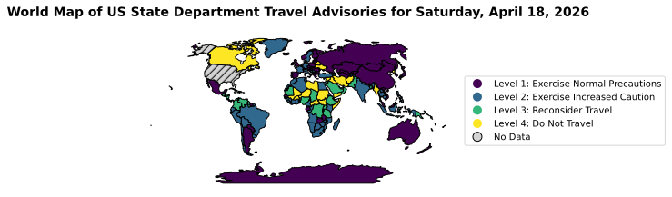

As of most recent update, the automated script will now update this dataset once per day at 12:00 UTC to archive data on US State Department Travel Advisories. While the most recent Data is desplayed below, the next additon to this project will allow interactive review of these data from prior dates. 

The source of these data is the US State Department RSS feed: https://travel.state.gov/_res/rss/TAsTWs.xml

The pypton file feed_test.py download the RSS feed, extratcs the relevant infomration and returns an archive that is usable by others. 
